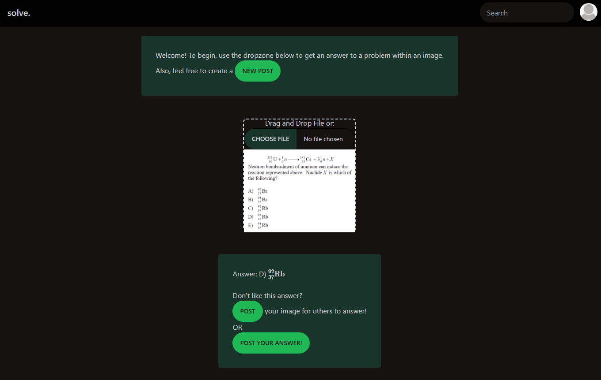

# solve.

## Introduction

solve is an easy-to-use problem solving application. Simply upload images of problems and the AI model will solve the problem. Don't like the answer?  You can post the problem immediately for others to view and answer.

## Technologies Used

- MERN stack (MongoDB, Express, React, Node.js)
- Amazon AWS S3
- OpenAI API
- Mathpix OCR API
- Tailwind
- Heroku for deployment

## Getting Started

Project planning was done through [Trello](https://trello.com/b/QrQSdAcH/solve).  

View the deployed version of [solve.](https://solve-app-fbb31bf6cc48.herokuapp.com/)

## Future Enhancements

- Upgrade AI model (GPT4)
- Edit posts/comments
- General styling

- Awards/points for uploading answered problems/answering with comments?